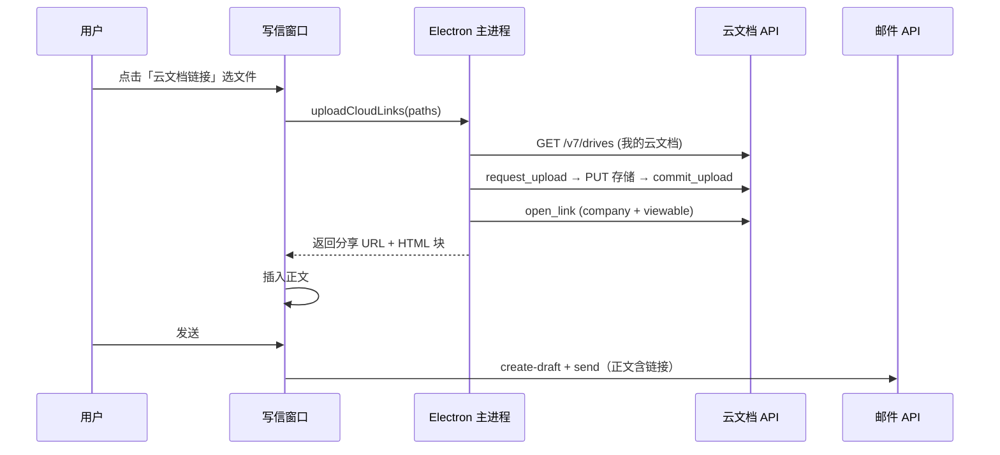

# V1.3 — 云文档链接附件（对齐 OWA OneDrive）

## 背景

| OWA | WPS Mail 客户端 V1.3 |
|-----|----------------------|
| 大附件 → OneDrive 分享链接 | 大附件 → **我的云文档** 分享链接 |
| 链接写在邮件正文 | 自动插入富文本链接块 |
| 传统 MIME 附件 API | 邮件 OpenAPI **无** `attachments/upload`（404） |

WPS 365 Web 邮箱产品侧有「超大附件自动转云文档」；V1.3 通过 **云文档 OpenAPI** 在桌面端复现同类体验。

---

## 用户流程



1. 写信 → **云文档链接** → 从云文档库选择（**最近** / **我的云文档** / 搜索）  
2. 对齐 [365.kdocs.cn/latest](https://365.kdocs.cn/latest) 的「最近」列表（**v1.3.1 起不再本地上传**）  
3. 对所选文件开启企业内分享（默认 `scope=company`）  
4. 正文插入可点击链接卡片  
5. 正常发送邮件（无 MIME 附件）

---

## 所需 OAuth Scope（需重新登录）

在开放平台应用权限中勾选，并更新 `.env`：

```
kso.drive.readwrite
kso.file.readwrite
kso.file_link.readwrite
```

（保留原有 `kso.mail.readwrite` 等邮件 scope。）

---

## 配置项（`.env` 可选）

| 变量 | 默认 | 说明 |
|------|------|------|
| `WPS_CLOUD_LINK_SCOPE` | `company` | 分享范围：`company` 本企业；`anyone` 公网 |
| `WPS_CLOUD_LINK_ROLE_ID` | `viewable` | 分享角色，失败时会尝试 `view_only` |
| `WPS_CLOUD_LINK_EXPIRE_DAYS` | `0` | 0=永久，7/30 天 |

---

## API 契约

| 步骤 | 方法 | 路径 |
|------|------|------|
| 获取我的云文档盘 | GET | `/v7/drives?allotee_type=user&sources=special` |
| 申请上传 | POST | `/v7/drives/{drive_id}/files/0/request_upload` |
| 上传实体 | PUT | `store_request.url`（存储网关） |
| 提交完成 | POST | `/v7/drives/{drive_id}/files/0/commit_upload` |
| 开启分享 | POST | `/v7/drives/{drive_id}/files/{file_id}/open_link` |
| 发信 | POST | `/v7/mailboxes/{id}/messages/create` + `send` |

`parent_path`: `["WPS Mail", "附件"]`

---

## 与 V1.2 附件策略并存

| 按钮 | 适用 | 机制 |
|------|------|------|
| **云文档链接** | PDF/Word/大文件/推荐 | 云盘 + 分享链 |
| **嵌入图片** | 小图 ≤2MB | data URI 进正文 |
| Web 邮箱 | 需标准附件图标时 | 人工 fallback |

---

## 限制与后续

- 收件人看到的是 **链接**，不是 Outlook 式附件图标（除非 WPS Web 对 kdocs 链有特殊渲染）。
- `role_id` 因企业而异，若分享失败请用 API Explorer 查 `list_roles` 并设置 `WPS_CLOUD_LINK_ROLE_ID`。
- 未做：从已有云文档选文件（文件选择器组件）、链接过期管理 UI、公共邮箱身份。

---

*版本：1.3.0 · 2026-06-04*
