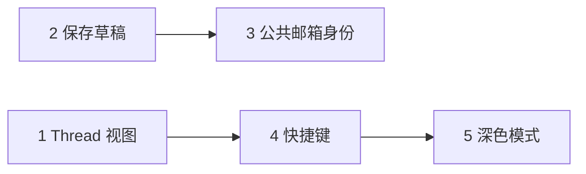

# V1.4 — 体验补强

> 目标：补齐 OWA 日常浏览/写信体验，在 V1.3 附件能力之上提升「像专业邮件客户端」的使用感。  
> 当前基线：**v1.3.2** · 2026-06-10

---

## 范围总览

| # | 功能 | 优先级 | 预估 | 依赖 |
|---|------|--------|------|------|
| 1 | 会话 thread 视图 | P0 | 2–3d | 列表 `thread_id`、`thread_message_count` |
| 2 | 仅保存草稿 | P0 | 1d | `create-draft` API（已有） |
| 3 | 公共邮箱发信身份 | P1 | 1–2d | 多 mailbox + send 参数 Explorer 复核 |
| 4 | 快捷键 | P1 | 1d | 无 |
| 5 | 深色模式 | P2 | 1d | CSS 变量（已有 `--*` 基础） |

**不在 V1.4**：星标/旗标、列表筛选 UI、定时发送 → 列入 V1.5 候选。

---

## 任务 1：会话 thread 视图

### 用户故事

作为员工，我希望收件箱里同一主题的往来邮件折叠成一条，点击后展开或进入会话详情，减少重复主题占屏。

### 现状

- 列表项含 `thread_id`、`MailDetail.thread_message_count`
- `ListMessagesParams.thread_id` 已在 mail-api 封装
- UI 仍为扁平列表，未分组

### 实现步骤

1. **数据层** `src/lib/threads.ts`
   - `groupByThread(items: MailListItem[]): ThreadGroup[]`
   - 同 `thread_id` 合并；无 thread_id 的邮件单独成组
   - 组内按 `ctime` 降序，组间取最新一封时间排序

2. **列表 UI** `src/App.tsx` + `src/components/ThreadListItem.tsx`
   - 折叠态：最新一封的主题/发件人/预览/未读数角标（组内未读合计）
   - 展开态：组内邮件子列表（缩进 + 较小字号）
   - 点击组内某一封 → 读信 pane 加载该封；可选「加载同 thread 其余邮件」

3. **读信区**（可选增强）
   - 读信 pane 顶部显示「此会话共 N 封」+ 上一封/下一封导航
   - 调用 `listMessages({ thread_id })` 拉全 thread（若 API 支持）

4. **缓存** `electron/main/db.ts`
   - 现有 JSON 缓存已存 `thread_id`，无需 schema 变更

### 验收

- [ ] 同 thread 多封在收件箱显示为 1 行（可展开）
- [ ] 展开后可选任意一封阅读
- [ ] 无 thread_id 的邮件行为与现版一致
- [ ] 搜索模式下仍扁平列表（或注明 V1.4 不支持 thread 分组）

---

## 任务 2：仅保存草稿

### 用户故事

写信过程中可「保存草稿」而不发送，稍后在草稿箱继续编辑。

### 现状

- `mail:send` IPC 走 `createDraft` → `sendDraft`
- 草稿箱文件夹 `drafts` 已在侧栏
- 无「保存」按钮、无打开草稿编辑

### 实现步骤

1. **IPC** `electron/main/ipc.ts`
   - 新增 `mail:saveDraft`：仅 `createDraft`，返回 `message_id`
   - 可选 `mail:updateDraft`（若 Explorer 有 update 路径）

2. **ComposeModal** `src/components/ComposeModal.tsx`
   - 底部增加 **保存草稿** 按钮（与「发送」并列）
   - 保存成功后 toast/状态提示，关闭或保持打开（建议关闭并刷新草稿夹）

3. **打开草稿编辑**（V1.4 最小范围）
   - 在 `drafts` 文件夹点击邮件 → 读信 pane 显示 **继续编辑** 按钮
   - 用 `getMessage` 正文回填 ComposeModal（`initial` props 扩展 `draftMessageId`）
   - 再次保存：若 API 无 update，则 create 新草稿 + 删旧草稿（本地兜底）

4. **文档** 更新 `API_CONTRACT.md`

### 验收

- [ ] 写信 → 保存草稿 → 草稿箱可见
- [ ] 草稿箱打开 → 继续编辑 → 可再次保存或发送
- [ ] 发送后从草稿箱消失（或进入已发送）

---

## 任务 3：公共邮箱发信身份

### 用户故事

我有权代发公共邮箱时，写信可选择「从 xxx@company.com 发出」，而不只是切换阅读邮箱。

### 现状

- 顶栏下拉可切换 `mailboxes`（含 `is_primary: false` 的公共邮箱）
- 写信始终用当前 `mailboxId`，无发件人选择器
- 公共邮箱 API 域：`public_mailbox`（管理侧为主）

### 实现步骤

1. **调研**（开发前 0.5d）
   - API Explorer：`create-draft` / `send` 是否支持 `from` / `sender` / `send_as` 字段
   - 查阅 `get-public-mailboxes` 返回结构与当前 `get-mailboxes` 差异

2. **mail-api** 扩展 `CreateDraftBody`（按 Explorer 结果）

3. **ComposeModal**
   - 当 `mailboxes.length > 1` 时显示 **发件身份** 下拉
   - 选项：当前用户主邮箱 + 有权限的公共邮箱
   - 公共邮箱在列表中标注 `(公共)`

4. **App.tsx**
   - 区分「阅读邮箱」与「发信身份」state（可默认发信身份=阅读邮箱）

### 验收

- [ ] 多邮箱账号下写信可选发件地址
- [ ] 收件人收到邮件显示所选公共邮箱地址
- [ ] 单邮箱用户 UI 无变化

### 风险

- 若 OpenAPI 不支持代发字段，V1.4 降级为「切换 mailboxId 后写信」并加 UI 提示。

---

## 任务 4：快捷键

### 用户故事

键盘高效操作：回复、删除、写新邮件，接近 OWA/Outlook 习惯。

### 建议映射（V1.4 首批）

| 键 | 动作 | 条件 |
|----|------|------|
| `N` | 新邮件 | 非输入框焦点 |
| `R` | 回复 | 已选邮件 |
| `Shift+R` | 全部回复 | 已选邮件 |
| `F` | 转发 | 已选邮件 |
| `Delete` | 删除 | 已选邮件 |
| `U` | 标未读 | 已选邮件 |
| `/` | 聚焦搜索框 | 全局 |
| `Esc` | 关闭写信/搜索 | — |

### 实现步骤

1. **`src/hooks/useMailShortcuts.ts`**
   - `useEffect` 监听 `keydown`
   - 忽略 `input/textarea/contenteditable` 焦点内（除 Esc）
   - 回调注入 App 现有 handler

2. **App.tsx** 接入 hook，与现有按钮逻辑复用

3. **帮助** 侧栏底部或 `?` 弹出快捷键表

### 验收

- [ ] 上述快捷键在中文输入法关闭状态下可用
- [ ] 写信/搜索输入时不误触发（除 Esc）
- [ ] 快捷键表可从 UI 查看

---

## 任务 5：深色模式

### 用户故事

夜间或弱光环境下使用深色界面。

### 实现步骤

1. **CSS** `src/styles/app.css`
   - 已有 `:root { --bg, --panel, ... }` → 增加 `[data-theme="dark"]` 覆盖
   - 读信 HTML 正文区增加 `.mail-body-reader` 深色背景/链接色

2. **状态** `src/hooks/useTheme.ts`
   - `localStorage.theme` = `light` | `dark` | `system`
   - `matchMedia('prefers-color-scheme')` 跟随系统

3. **UI** 顶栏或设置区切换三态

4. **Electron**（可选）`nativeTheme.themeSource` 与窗口 chrome 一致

### 验收

- [ ] 三栏布局、写信、弹窗在深色下可读
- [ ] 刷新/重启后记住选择
- [ ] 读信 HTML 外链样式不刺眼

---

## 建议开发顺序

1. **保存草稿** — 独立、API 现成、用户价值高  
2. **Thread 视图** — 改动面最大，需专注  
3. **公共邮箱身份** — 依赖 Explorer，可与 thread 并行调研  
4. **快捷键** — thread/compose 稳定后接入  
5. **深色模式** — 最后做，避免 UI 反复调色  

---

## 版本与文档

完成 V1.4 后更新：

- `package.json` → `1.4.0`
- `CHANGELOG.md`、`docs/VERSION.md`
- `docs/FEATURE_GAP.md` 路线图勾选
- Git tag `v1.4.0` + GitHub Release

---

*规划版本：2026-06-10*
