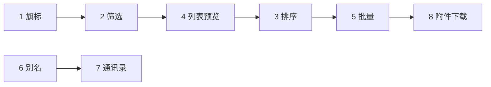

# V1.5 — OWA 列表与标记能力

> 目标：补齐 OWA 日常「浏览收件箱」的高频操作——旗标、筛选、排序、批量处理与联系人/别名发信；V1.4 已覆盖 thread、草稿、快捷键与深色模式。  
> 当前基线：**v1.4.4** · 2026-06-10

---

## 范围总览

| # | 功能 | 优先级 | 预估 | API / 依赖 | 版本目标 |
|---|------|--------|------|------------|----------|
| 1 | 星标 / 旗标切换 | P0 | 1d | `updateMessage.is_flag`（IPC 已有） | v1.5.1 |
| 2 | 列表筛选（未读 / 已标旗） | P0 | 1–2d | `filter=unread\|flagged`（mail-api 已封装） | v1.5.1 |
| 3 | 列表排序 | P1 | 1d | **无服务端 sort** → 客户端对当前页/缓存排序 | v1.5.2 |
| 4 | 列表预览与旗标视觉 | P1 | 1d | `body_preview`、`is_flag` 字段已有 | v1.5.2 |
| 5 | 多选批量操作 | P1 | 2–3d | delete / move / update 已有，补 UI | v1.5.3 |
| 6 | 别名发信身份 | P2 | 1–2d | `GET /v7/user_mailboxes/{id}/aliases`（应用 scope） | v1.5.4 |
| 7 | 通讯录侧栏 / 管理 | P2 | 2d | `mail_contacts` CRUD（部分已用于联想） | v1.5.4 |
| 8 | 附件下载（MIME） | P2 | 1–2d | `GET .../attachments/{id}/download_url` | v1.5.5 |

**明确不在 V1.5**（无 OpenAPI 或管理侧能力）：

- 定时发送、稍后提醒（Snooze）
- 文件夹创建 / 重命名 / 删除（V1.4.4 已链 Web 管理）
- 邮件规则、自动答复、撤回发送
- 实时推送（仍用轮询 + 托盘；V2 再评估 webhook）

**候选放入 V1.6 / V2**：

- 统一收件箱（多 mailbox 合并列表）
- 归档快捷操作（需确认 WPS 是否有 archive 系统夹或专用 API）
- 离线发信队列（outbox 重试）
- IMAP 副通道

---

## 任务 1：星标 / 旗标切换

### 用户故事

我希望像 OWA 一样给重要邮件加旗标，并在列表里一眼看到，方便跟进。

### 现状

- 列表 / 详情含 `is_flag`
- `mail:updateMessage` 已支持 `isFlag`，失败时本地仍更新
- UI 无切换入口，无旗标图标

### 实现步骤

1. **读信区** `src/App.tsx`：增加「标为旗标 / 取消旗标」按钮（或 ★ 切换）
2. **列表行** `ThreadListItem` / 扁平行：左侧或右侧旗标图标，点击 toggle（阻止冒泡）
3. **快捷键** `useMailShortcuts.ts`：可选 `I` 切换旗标（Outlook 习惯）
4. **缓存** `db.ts`：update 时同步 `is_flag` 字段（若尚未写入）

### 验收

- [ ] 列表与读信区旗标状态一致
- [ ] 刷新 / 切换文件夹后旗标与服务端一致（API 成功时）
- [ ] API 失败时本地仍可标记，并提示「仅本地」

---

## 任务 2：列表筛选（未读 / 已标旗）

### 用户故事

在收件箱快速只看未读或已加旗邮件，不必每次搜索。

### 现状

- `ListMessagesParams.filter`：`unread` | `flagged`
- `SearchMailParams.filter` 同上
- UI 无筛选控件；thread 分组与筛选的交互未定义

### 实现步骤

1. **状态** `App.tsx`：`listFilter: 'all' | 'unread' | 'flagged'`
2. **工具栏** 列表上方：分段按钮或下拉「全部 / 未读 / 旗标」
3. **loadMessages** 传入 `filter`；切换筛选时重置分页
4. **Thread 模式**：组内任一封匹配即显示该组，或组标题显示组内未读/旗标数（与 OWA 对齐需产品拍板，默认：**组内最新一封匹配即保留整组**）
5. **搜索模式**：高级搜索区增加「仅未读 / 仅旗标」勾选项

### 验收

- [ ] 收件箱 / 自定义文件夹可筛选
- [ ] 草稿箱 / 已发送筛选行为合理（可隐藏「旗标」或禁用）
- [ ] 与「加载更多」分页兼容

---

## 任务 3：列表排序

### 用户故事

按日期、发件人或主题排序邮件，方便查找。

### 现状

- OpenAPI **未文档化** `sort` / `order_by` 查询参数
- 当前按 API 返回顺序（通常 `ctime` 降序）+ thread 组内排序

### 实现步骤

1. **调研**（0.5d）：API Explorer 实测列表接口是否支持未文档化排序参数
2. **若无服务端排序**：对**当前已加载列表**客户端排序（注明「仅当前页/已加载邮件」）
3. **UI** 列表工具栏：排序下拉（日期↓、日期↑、发件人 A–Z、主题 A–Z）
4. **Thread 模式**：组间按组内「代表邮件」排序后的键排序

### 验收

- [ ] 非 thread 文件夹排序正确
- [ ] Thread 模式下组顺序符合所选规则
- [ ] 加载更多后排序策略文档化（重新全量排 or 仅新页 merge）

### 风险

- 全量排序需拉取全部邮件，page_size=10 时体验差 → V1.5 仅保证**已加载集合**排序，或限制在「未启用 thread 的文件夹」。

---

## 任务 4：列表预览与旗标视觉

### 用户故事

列表行显示一行正文预览，旗标/未读/附件图标清晰，接近 OWA 信息密度。

### 现状

- `body_preview` 已在类型中，列表 UI 可能未展示或展示不全
- 未读加粗已有；旗标、附件图标待统一

### 实现步骤

1. **MailRow / ThreadListItem**：第二行 `body_preview`（单行 ellipsis）
2. **图标列**：未读圆点、★ 旗标、📎 附件（has_attachments）
3. **深色模式** 下图标对比度检查

### 验收

- [ ] 三栏宽度下预览不撑破布局
- [ ] 无 preview 时留空或显示「(无预览)」

---

## 任务 5：多选批量操作

### 用户故事

按住 Ctrl 或多选 checkbox，批量删除、移动或标已读/旗标。

### 现状

- 单封 delete / move / update 已可用
- 无多选 state

### 实现步骤

1. **状态** `selectedIds: Set<string>`；列表行 checkbox（Shift 连选可选）
2. **工具栏** 选中 ≥1 时显示：删除、移动、标已读、标未读、加旗标、取消旗标
3. **IPC** 顺序调用现有 API（或新增 `mail:batchUpdate` 包装 Promise.all + 进度）
4. **Thread 模式**：选中组头 = 选中组内全部（可选 V1.5 简化为仅扁平多选）

### 验收

- [ ] 批量删除后列表与未读数更新
- [ ] 批量移动后从当前夹消失
- [ ] 失败时部分成功有明确反馈

---

## 任务 6：别名发信身份

### 用户故事

主邮箱绑定了别名地址时，写信可选择「从 alias@company.com 发出」。

### 现状

- V1.4.2 已支持公共邮箱发信身份（`mailboxes` 切换）
- `alias_mailbox.get-user-aliases` 为**应用授权** API，需 `kso.user_mailbox.read`

### 实现步骤

1. **调研**：`create-draft` 是否接受别名 mailbox / from 字段；与公共邮箱代发字段是否相同
2. **mail-api** `listUserAliases(userId)`
3. **ComposeModal** 发件身份下拉合并：主邮箱 + 公共邮箱 + 别名（分组标注）
4. **权限**：无 scope 时隐藏别名区块，设置页说明

### 验收

- [ ] 有别名且 API 可用时可选别名发信
- [ ] 无权限时不报错，UI 降级

### 风险

- 别名 API 为应用级，用户 OAuth 客户端可能无法调用 → 需 IT 在开放平台开通 scope 或改用用户级接口（若有）。

---

## 任务 7：通讯录侧栏 / 管理

### 用户故事

查看企业通讯录联系人，写信时除联想外可浏览、搜索联系人。

### 现状

- `loadContacts` + ComposeModal datalist 联想
- OpenAPI 有 contacts CRUD，客户端未做管理 UI

### 实现步骤

1. **V1.5 最小范围**：侧栏或模态「通讯录」只读列表 + 搜索 + 点击填入写信收件人
2. **可选增强**：新建 / 编辑联系人（需 write scope）
3. **与写信联动**：「写信给此人」打开 ComposeModal 并填 to

### 验收

- [ ] 联系人列表可搜索
- [ ] 从联系人发起写信成功
- [ ] 无 mail_contact scope 时使用本地缓存 / 提示

---

## 任务 8：附件下载（MIME）

### 用户故事

读信时下载真实附件文件，而不只是云文档链接。

### 现状

- 正文内云文档链接 V1.3 已支持
- `GET .../attachments/{attachment_id}/download_url` 已文档化，客户端未接

### 实现步骤

1. **mail-api** `getAttachmentDownloadUrl(...)`
2. **IPC** `mail:downloadAttachment` → 主进程 `shell.openExternal` 或保存对话框
3. **MailBodyReader** 附件列表 UI：文件名、大小、下载按钮

### 验收

- [ ] 点击下载可获得文件或浏览器下载
- [ ] 无权限 / 404 时有明确错误

---

## 建议开发顺序

1. **旗标** — API 就绪，改动小，用户感知强  
2. **筛选** — 与旗标联动，完成「跟进邮件」闭环  
3. **列表预览** — 提升浏览体验，为排序提供视觉反馈  
4. **排序** — 依赖已加载数据策略，可与 Explorer 调研并行  
5. **批量** — 依赖单封操作稳定  
6. **别名 / 通讯录** — 依赖 scope 调研，可并行  
7. **附件下载** — 独立，可穿插在批量之后  

---

## 版本切分建议

| 版本 | 内容 |
|------|------|
| **v1.5.1** | 旗标 + 列表筛选 |
| **v1.5.2** | 列表预览视觉 + 客户端排序 |
| **v1.5.3** | 多选批量操作 |
| **v1.5.4** | 别名发信 + 通讯录只读 |
| **v1.5.5** | MIME 附件下载 |

每小版本可独立发布，便于回归与 GitHub Release 说明。

---

## 版本与文档

开发过程中更新：

- `package.json` / `CHANGELOG.md`
- `docs/FEATURE_GAP.md` 路线图
- 完成 V1.5 全量后 Git tag `v1.5.0`（或沿用末个子版本号）

---

*规划版本：2026-06-10*
